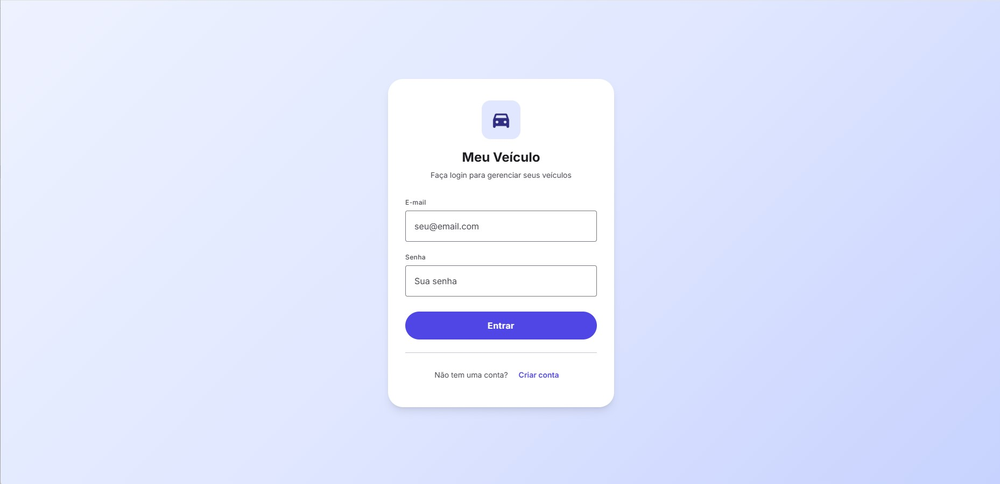

# Meu Veículo em Dia 🚗


Aplicação completa para gestão de veículos, controle de abastecimentos, manutenções preventivas e despesas financeiras. O sistema oferece uma visão clara dos custos de propriedade, ajudando proprietários a manterem seus veículos em dia.



## 🚀 Visão Geral e Arquitetura

Este projeto segue uma arquitetura moderna de **Monólito Modular** com separação clara entre Frontend e Backend:

- **Backend (API Restful)**: Desenvolvido em **Laravel 12**, responsável pela regra de negócios, autenticação via **Sanctum**, validação de dados e interação com o banco de dados (SQLite para desenvolvimento, MySQL para produção).
- **Frontend (SPA)**: Construído com **Vue 3 (Composition API)** e **Vite**, utilizando **Pinia** para gerenciamento de estado global e **Vue Router** para navegação.
- **Design System**: Interface customizada baseada nos princípios do **Material Design 3**, implementada com CSS nativo e variáveis para fácil manutenção e consistência visual.

## ✨ Funcionalidades Detalhadas

### 🔐 Autenticação e Segurança
- Sistema completo de login e registro de usuários.
- Proteção de rotas via tokens Sanctum.
- Sessão persistente e segura.

### 🚙 Gestão de Frotas
- Cadastro ilimitado de veículos.
- Suporte a múltiplos tipos de combustível (Gasolina, Etanol, Diesel, Flex, Elétrico).
- Edição rápida de detalhes do veículo via modal.

### ⛽ Controle de Abastecimento
- Registro de cada abastecimento com data, posto, valor por litro e total.
- **Cálculo de Autonomia**: O sistema calcula automaticamente a média de consumo (km/l) baseada no odômetro e litros abastecidos.
- Histórico completo de abastecimentos por veículo.

### 🔧 Manutenção Preventiva
- Agendamento e registro de serviços (Troca de óleo, Revisão, Pneus, Freios).
- Controle de quilometragem da próxima revisão.
- Histórico de custos com manutenção.

### 💰 Gestão Financeira (Despesas)
- Categorização de gastos extras (IPVA, Seguro, Multas, Estacionamento, Lavagem).
- Visão clara do Custo Total de Propriedade (TCO).

### 📊 Dashboard e Relatórios
- Cards com resumo da frota.
- Gráficos de custos mensais.
- Comparativo de gastos por categoria.

## 🛠️ Tecnologias Utilizadas

### Backend
- **Framework**: Laravel 12.x
- **Banco de Dados**: SQLite (Dev) / MySQL (Prod)
- **Autenticação**: Laravel Sanctum

### Frontend
- **Framework**: Vue.js 3.5+
- **Build Tool**: Vite
- **State Management**: Pinia
- **Router**: Vue Router 4
- **HTTP Client**: Axios
- **Ícones**: Google Material Symbols

## 📦 Instalação e Configuração

### Pré-requisitos
- PHP 8.2 ou superior
- Composer
- Node.js (LTS) & NPM

### Passo a Passo

1.  **Clone o repositório**:
    ```bash
    git clone https://github.com/SEU_USUARIO/meu-veiculo.git
    cd meu-veiculo
    ```

2.  **Instale as dependências do Backend**:
    ```bash
    composer install
    ```

3.  **Instale as dependências do Frontend**:
    ```bash
    npm install
    ```

4.  **Configure o ambiente**:
    ```bash
    cp .env.example .env
    php artisan key:generate
    touch database/database.sqlite
    ```

5.  **Execute as migrações e o Seeder**:
    *O comando abaixo cria as tabelas e popula o banco com dados de teste para facilitar a visualização.*
    ```bash
    php artisan migrate --seed
    ```

## ▶️ Executando a Aplicação

Para rodar o projeto em ambiente de desenvolvimento, você precisará de dois terminais:

**Terminal 1 (Servidor API):**
```bash
php artisan serve
```

**Terminal 2 (Servidor Frontend):**
```bash
npm run dev
```

Acesse a aplicação em: `http://localhost:8000`

## 📚 Documentação da API

Principais endpoints disponíveis:

| Método | Endpoint | Descrição |
| :--- | :--- | :--- |
| `POST` | `/api/register` | Cria uma nova conta de usuário |
| `POST` | `/api/login` | Autentica o usuário e retorna token |
| `GET` | `/api/vehicles` | Lista todos os veículos do usuário |
| `POST` | `/api/vehicles` | Cadastra um novo veículo |
| `GET` | `/api/vehicles/{id}` | Detalhes de um veículo específico |
| `GET` | `/api/fuel-entries` | Lista abastecimentos |
| `POST` | `/api/fuel-entries` | Registra novo abastecimento |
| `GET` | `/api/maintenances` | Lista manutenções |

## 🤝 Contribuição

Contribuições são bem-vindas! Sinta-se à vontade para abrir issues ou enviar pull requests com melhorias.

## 📄 Licença

Este projeto está sob a licença MIT. Veja o arquivo [LICENSE](LICENSE) para mais detalhes.
